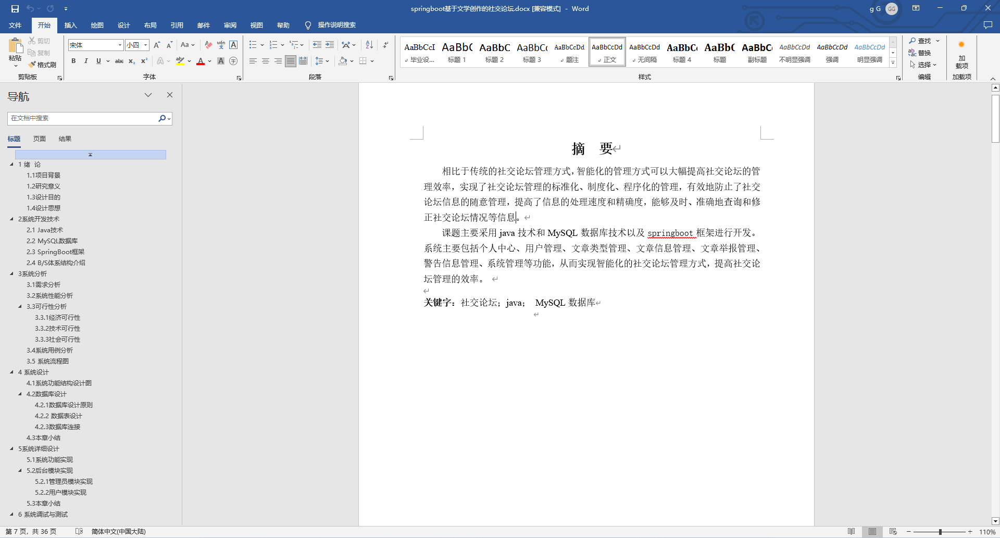
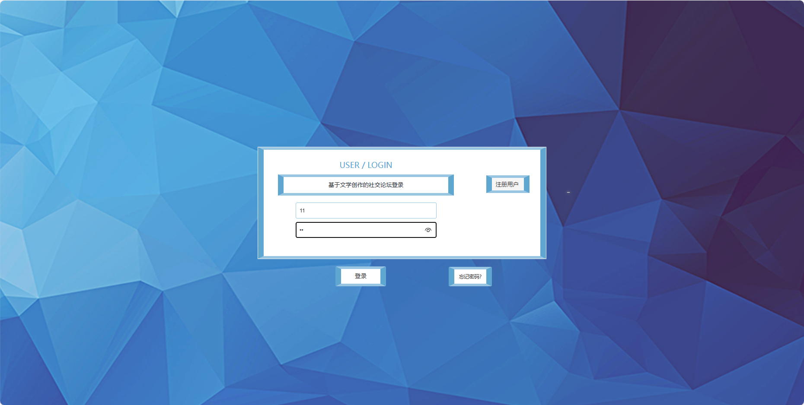
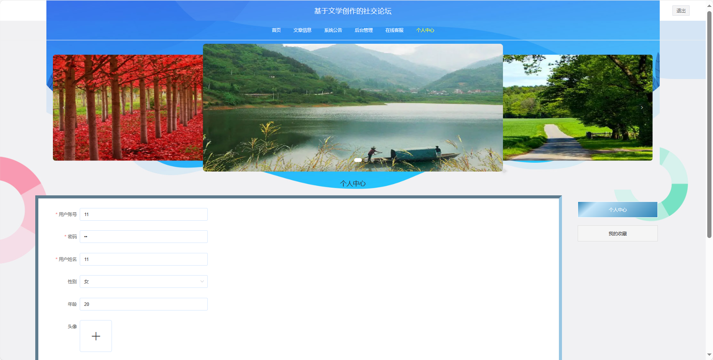
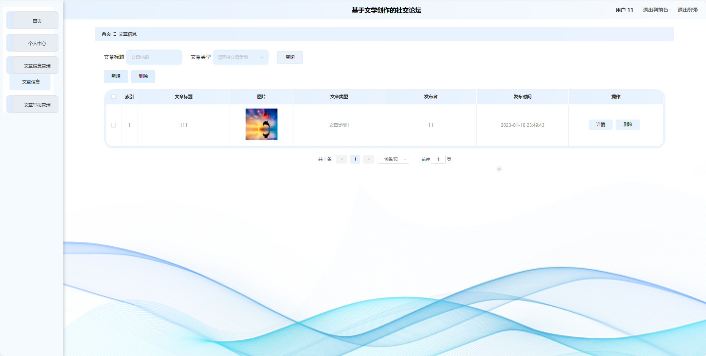
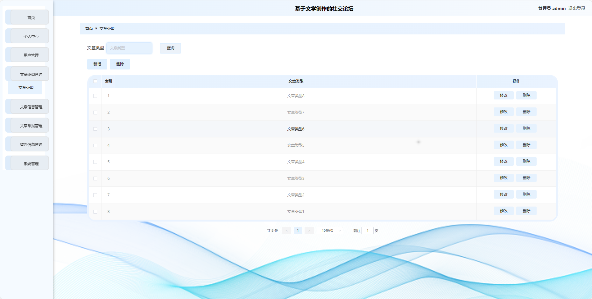
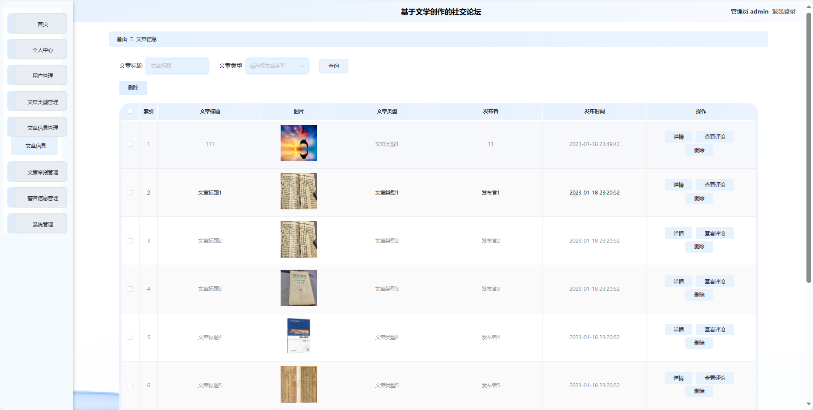
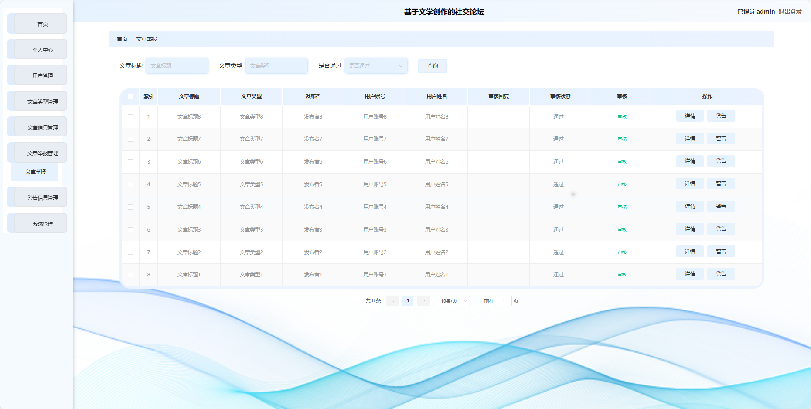

## 基于SpringBoot的文学创作社交论坛(程序+报告)

- <b>完整代码获取地址：从戎源码网 ([https://armycodes.com/](https://armycodes.com/))</b>
- <b>技术探讨、资料分享，请加QQ群：692619798</b> 
- <b>作者微信：19941326836  QQ：952045282</b> 
- <b>承接计算机毕业设计、Java毕业设计、Python毕业设计、深度学习、机器学习</b>
- <b>选题+开题报告+任务书+程序定制+安装调试+论文+答辩ppt 一条龙服务</b>
- <b>所有选题地址 ([https://github.com/YuLin-Coder/AllProjectCatalog](https://github.com/YuLin-Coder/AllProjectCatalog)) </b>

## 项目介绍
基于SpringBoot的文学创作社交论坛，系统包含两种角色：管理员、用户主要功能如下。

### 【管理员】:
1. **首页：** 查看社交论坛整体概况。
2. **个人中心：** 修改密码、管理个人信息。
3. **用户管理：** 审核和管理注册用户的信息。
4. **火车类型管理：** 管理文学创作的分类信息。
5. **火车信息管理：** 监管和管理社交论坛上的文学创作信息。
6. **车票预订管理：** 查看和管理用户的文学创作预订情况。
7. **车票退票管理：** 处理用户对已预订文学创作的退票请求。
8. **系统管理：**
   - **公告资讯：** 发布、编辑和删除系统的通知和公告。
   - **关于我们：** 编辑和更新社交论坛的介绍。
   - **系统简介：** 提供社交论坛的简要介绍。
   - **轮播图管理：** 管理社交论坛首页的轮播图。

### 【用户】:
1. **首页：** 浏览社交论坛的主要信息。
2. **火车信息：** 阅读和浏览用户发布的文学创作。
3. **公告资讯：** 查看社交论坛发布的重要通知和公告。
4. **后台管理：**
   - **首页：** 进行后台管理相关操作。
   - **个人中心：** 管理个人信息，查看火车票订购历史等。
   - **车票预订管理：** 预订文学创作，选择特定的创作者或主题。
   - **车票退票管理：** 处理用户对已预订文学创作的退票请求。
5. **个人中心：** 管理个人信息。

## 项目技术
- 编程语言：Java
- 数据库：MySQL
- 项目管理工具：Maven
- 前端技术：HTML、CSS、JavaScript、Jquery、Vue
- 后端技术：Spring、SpringMVC、MyBatis

## 运行环境
- JDK版本：JDK1.8及以上
- 开发工具：IDEA、Ecplise、Myecplise都可以
- 数据库: MySQL5.7及以上
- Maven：maven3.0及以上
- Node：14.14.0及以上

## 运行截图

